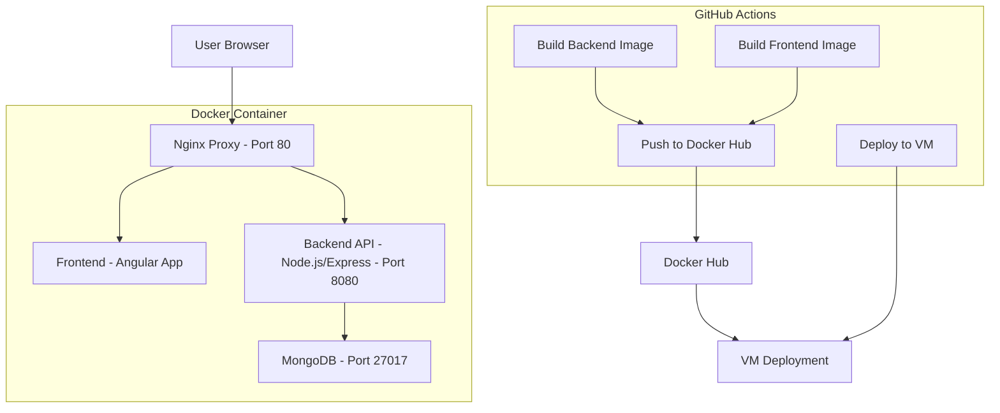

# Application Architecture

## Component Descriptions

### User Browser

- Accesses the application through a web browser
- Connects to port 80 of the deployed VM

### Nginx Proxy

- Serves as the entry point for all requests
- Routes static content requests to the frontend
- Routes API requests (/api/\*) to the backend

### Frontend (Angular)

- Single-page application built with Angular 15
- Communicates with backend through HTTP requests
- Served by Nginx within its container

### Backend API (Node.js/Express)

- Provides RESTful API endpoints for tutorial management
- Connects to MongoDB for data persistence
- Handles CRUD operations for tutorials

### MongoDB

- Stores tutorial data with fields: ID, title, description, published status
- Uses volume mapping for persistent data storage

### CI/CD Pipeline

- Automated workflow triggered on code pushes to main branch
- Builds separate Docker images for frontend and backend
- Pushes images to Docker Hub
- Deploys latest images to VM through SSH
